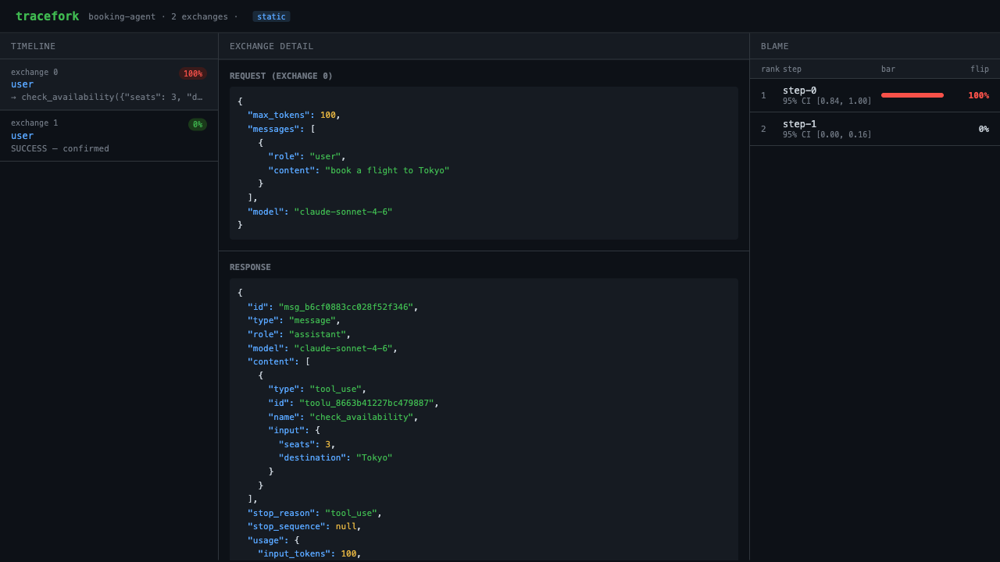

# tracefork

[](https://github.com/pratik916/tracefork/actions/workflows/ci.yml)
[](LICENSE)
[](https://www.python.org/downloads/)
[](https://github.com/astral-sh/ruff)

**A time-travel debugger for AI agents: record a run to a content-addressed tape, replay
it bit-for-bit for $0 — proven by hash, not asserted — fork any step, and, validated on
controlled fixtures, measure which step is causally responsible for a failure, with
confidence intervals.**



*The three-panel report: a run's timeline (left) with causal-blame badges, the
request/response for the selected exchange (center), and the blame ranking with 95%
confidence intervals (right). Generated offline, for $0, by
[`examples/demo_report.py`](examples/demo_report.py).*

---

## The idea

Every agent-observability tool shows you a trace and asks you to eyeball it. tracefork
treats an agent run like a recording you can rewind, branch, and reason about causally:

- **Record** every model call into a content-addressed **tape** at the HTTP seam of the
  Anthropic SDK, capturing the sources of nondeterminism (clock, ids) the agent reads.
- **Replay** the tape **bit-exact for $0** — every replayed request's *body* is
  sha256-checked against the tape, so it's *proven* identical, not asserted. (The matched
  surface is the request body; request headers such as `anthropic-beta` are out of scope —
  see [Determinism boundary](#determinism-boundary-v1-honest-scope).) No network, no key.
- **Fork** any step: swap in a different model response and let the *same* agent run
  forward from there. The unchanged prefix replays for free; only the new tail costs
  anything.
- **Blame**: resample those forks across every step and rank each by its **flip-rate** —
  how often perturbing it changes the run's outcome — with **Wilson score** confidence
  intervals so a small sample can't masquerade as certainty.
- **Validate the instrument itself**: inject faults with *known* root causes and confirm
  the blame engine fingers the right step. On a short positive-vs-inert control the engine
  is genuinely causal — it ranks whichever step actually flips the outcome #1, not a fixed
  slot — hitting **1.00 top-1 precision** across five injection mechanisms, offline, against
  a flat negative control that's *enforced*, not just printed.
- **Discriminate among competing causes**: a second, longer fixture plants *several*
  causally-distinct faults on one tape at once — a root cause, a downstream echo that must
  not be blamed as the root, and a two-part necessary-not-sufficient conjunction — and
  measures whether the coalition/temporal-Shapley engine tells them apart (`tracefork
  bench`). 8 of 9 cases resolve exactly as planted; the one that doesn't is reported as a
  named, honest limitation, not hidden. This — and the published ~14.2% log-based
  step-attribution anchor it's cited alongside (Who&When, ICML 2025) — is internal, labeled
  evidence, not a run against that benchmark's real data. See
  [Validation scope](#validation-scope) for exactly what each number does and doesn't claim.

That last two pillars are the point: a debugger that claims to find root causes has to be
held to ground truth. `tracefork validate` and `tracefork bench` are that proof, and both
run in a few seconds with no API key.

## Quickstart (offline, $0, no API key)

Python **3.12** via [uv](https://docs.astral.sh/uv/). Everything below is offline and
makes no network calls.

```bash
uv sync --extra dev

# 1. The full offline test suite (653 tests) -- including a cross-module,
#    whole-pipeline suite (tests/test_e2e.py) and an all-CLI-commands smoke
#    test (tests/test_cli_smoke.py), not just per-module unit tests.
uv run pytest -q

# 2. The instrument validates itself against injected, known-root-cause faults.
uv run tracefork validate

# 2b. ...and against several SIMULTANEOUS, competing faults on a longer tape.
uv run tracefork bench

# 3. Generate the demo report shown above, then open it in any browser.
uv run python examples/demo_report.py
open examples/demo_report.html      # macOS; or just open the file

# 4. The original Spike 0 receipt: record → persist → replay → prove bit-exact.
uv run python -m tracefork_spike
```

Run the full E2E receipt — sync, lint, format, type-check, tests+coverage, the
self-validation and replay-fixture-corpus regression gates, the competing-fault
benchmark, and a package build/twine check, as one script with a single
PASS/FAIL verdict:

```bash
bash scripts/e2e.sh
```

`tracefork validate` prints:

```
  [PASS] corrupted_tool_output               top-1: 1.00
  [PASS] misleading_retrieval                top-1: 1.00
  [PASS] wrong_system_prompt                 top-1: 1.00
  [PASS] dropped_message                     top-1: 1.00
  [PASS] poisoned_argument                   top-1: 1.00

  overall top-1 precision: 1.00
  negative control max flip: 0.00 (threshold 0.30)
```

## The CLI

```bash
uv run tracefork --help
```

| Command | What it does |
|---|---|
| `replay  <tape> --agent pkg.mod:fn` | Replay a tape and print the bit-exact verification receipt. |
| `replay  --check <fixtures dir>` | Replay-as-regression gate: assert every fixture in a committed tape corpus replays bit-exact and its `digest()` matches. |
| `verify  <tape> --agent pkg.mod:fn` | Verify replay; exit non-zero on drift (CI gate). |
| `fork    <run_id> --step N --response f --agent pkg.mod:fn` | Fork a run at step N with a mutated response; record the counterfactual branch. |
| `blame   <run_id> --agent pkg.mod:fn [--k 10] [--budget 5.0]` | Rank every step by causal flip-rate with 95% CIs (re-runs the agent; budget-capped). |
| `report  <run_id> \| --tape <tape> -o out.html` | Render the self-contained three-panel HTML report. |
| `serve   [--store store.db] [--port 7777]` | Serve the live web UI (same-origin, 127.0.0.1). |
| `validate [--k 3] [--n-runs 5] [--check]` | Run the fault-injection suite; `--check` gates against the committed report. |
| `bench   [--k 3] [--m-samples 2]` | Long-tape competing-fault benchmark: does the coalition/temporal-Shapley engine discriminate *several* simultaneously planted causes, not just detect one? See [Validation scope](#validation-scope). |
| `export  <run_id> --otel\|--openinference -o out.json` | Export a tape (+ optional `--blame-report`) as an OTel GenAI trace or an OpenInference dataset. |
| `ingest  <trace.json> --otel\|--openinference -o out.tape.sqlite` | Build a tape's step structure from an externally-produced trace — blame-by-re-execution only, **not** bit-exact replayable. |
| `proxy   record\|replay --tape <tape> [--upstream url] [--port 8899]` | Localhost base-URL record/replay proxy for non-Python clients (curl, Node, Go, ...) — see [Localhost record/replay proxy](#localhost-recordreplay-proxy-for-non-python-clients-opt-in). |

Replay, verify, fork, and the offline demos need no key. `blame` against a *real* run
re-runs the agent's counterfactual tails against the live API, which is why it's
budget-capped — the offline, $0 proof that blame works is `tracefork validate`.

## How it works

The spine is a **record/replay seam at the Anthropic SDK's httpx boundary** plus a
**nondeterminism-virtualization seam** the agent reads time and ids through. Bit-exactness
is the contract between them.

- **`transport.py`** — `TraceforkTransport` (sync) / `AsyncTraceforkTransport` (async).
  Record mode tees request+response bytes into the tape (buffering streaming SSE and
  plain JSON identically via `.read()`/`.aread()`); replay mode serves recorded bytes and
  sha256-asserts every request body matches the tape. A replay transport has **no inner
  transport**, so an unrecorded request is a hard error, never a silent network call.
- **`tape.py`** — content-addressed (sha256) blobs + an ordered event log, persistable to
  SQLite, with a hash-chain `digest()` fingerprint.
- **`nondet.py`** — `NondetSource` is the only way the agent gets time/ids/random draws;
  `RecordingNondet` logs real draws, `ReplayNondet` serves them back, `DriftingNondet` is
  the negative control. `find_divergence()` unwraps the `DivergenceError` the SDK buries
  inside an `APIConnectionError` so a real divergence isn't mistaken for a network blip.
- **`boundary_guard.py`** — opt-in (default off) `BoundaryGuard`: hard-errors at record
  time on thread/subprocess spawn or direct `random`/clock reads that bypass
  `NondetSource`, instead of letting the tape fail replay later, mysteriously.
- **`fork.py`** — `ForkTransport` runs three phases: **prefix-replay** (served from the
  parent tape for $0, request asserted to match — the agent must be deterministic up to
  the fork point), **mutation-injection** (same request, swapped response), and
  **tail-record** (the counterfactual continuation recorded fresh). A `Branch` carries
  `prefix_replayed`/`tail_recorded` counters that quantify the savings.
- **`blame.py`** — forks each step `k` times, re-runs the agent, grades the outcome via an
  `Oracle`, and counts flips vs. the parent outcome. `wilson_ci()` gives the interval;
  `BudgetGovernor` estimates fork count and dollar cost before any spend.
- **`faults.py` / `validate.py`** — five fault classes, each producing *valid* Anthropic
  JSON with a marker embedded inside a content field. A synthetic agent echoes each
  response into its next request, so an injected fault propagates through a fork to a
  fault-aware tail and flips the outcome — letting the blame engine be scored against
  ground truth entirely offline.
- **`report.py` / `server.py` / `web/report.html`** — a single, dependency-free HTML file
  (vanilla JS, no npm) rendered statically by `report` or served live by `serve`.
- **`interop.py`** — `gen_ai.*`/OpenInference export (`export`) and ingest (`ingest`); see
  [OTel / OpenInference interop](#otel--openinference-interop-opt-in) for the precise,
  blame-only-not-bit-exact scope of the ingest direction.
- **`observability.py`** — opt-in (`observability` extra) structlog JSON logging and OTel
  self-instrumentation of record/replay/fork/blame; a no-op until explicitly enabled, so
  installing the extra alone changes nothing.

## Determinism boundary (v1, honest scope)

Bit-exact replay holds within a declared boundary: **single-process (sync or asyncio),
clock + id + random nondeterminism, captured through `NondetSource`**. An agent that reads
`datetime.now()` / `uuid` / `random` directly, or runs its loop across threads/subprocesses,
steps outside that boundary — and the verifier will *detect* the resulting drift rather than
paper over it. Forking and blame assume the agent rebuilds its prefix deterministically (the
same property replay proves). See [`SPIKE0.md`](SPIKE0.md) for how the boundary was de-risked.

**Concurrency-graph determinism (asyncio).** asyncio is deterministic *except* for the
order in which concurrent in-flight requests (an `asyncio.gather`/`TaskGroup` fan-out)
resolve — and that order is driven by the very I/O tracefork already records. So the async
transport records the completion order (and logs each fully-overlapping fan-out batch to the
tape) and, on replay, **correlates each request to its recorded exchange by fingerprint and
releases responses in the recorded completion order** — a fan-out agent replays bit-exact,
not just a single-call-at-a-time one. A strictly-sequential async run (one `await` at a
time — the common case) is byte-identical to before, and the sync path is untouched. The
recorded order can also be replayed under a seeded *reordering* (`chaos_release_order`) to
surface completion-order-dependent ("race"/ordering) bugs. Nested fan-out where a request is
sent only *after* an earlier one in the same batch completed is replayed faithfully in the
recorded order but is not reordered by chaos (it isn't a physically-reorderable batch).

An opt-in `BoundaryGuard` (default off; `Recorder(..., boundary_guard=True)` or
`TraceforkConfig(boundary_guard=True)`) turns *some* of these violations — thread/
subprocess spawn, direct `random.random()`/`time.monotonic()`/`time.sleep()` — into a loud
error at record time instead of a drift only discovered on replay. It deliberately can't
intercept everything: `datetime.datetime.now()` is a classmethod on an immutable C type
(can't be monkeypatched without breaking the SDK's pydantic schema builder — see
`recorder.py`), and `time.time()` is called unconditionally by httpx's cookie-jar
machinery on every response, so guarding it would false-positive on every exchange. See
`boundary_guard.py`'s module docstring for the full, precise scope.

## Redaction (opt-in)

Recording real traffic can put secrets and PII on a tape. Redaction is entirely opt-in —
`Recorder`/`AsyncRecorder` behave byte-for-byte as before unless you pass a `redactor`:

```python
from tracefork import Recorder, safe_defaults, with_content_redaction

# Metadata only: auth headers + known secret env values (ANTHROPIC_API_KEY, ...).
# Fully bit-exact-replayable — redaction runs inside the matcher seam, so record
# and replay hash the identical redacted form.
with Recorder(client, redactor=safe_defaults()) as rec:
    ...

# Opt in further: also scrub message CONTENT (prompts/completions), mirroring
# OTEL_INSTRUMENTATION_GENAI_CAPTURE_MESSAGE_CONTENT. This marks the tape
# `content_redacted = True` — forensic-only, NOT guaranteed bit-exact
# replayable, because the agent sees redacted text on replay instead of the
# real completion, and a redacted request can no longer prove a genuine
# prompt change didn't happen.
with Recorder(client, redactor=with_content_redaction()) as rec:
    ...
```

Redactors never affect what the live agent sees during recording — only what lands on the
tape. See `redact.py` for the full pipeline (ordered `RedactorFn` callbacks, `regex_redactor`,
`secret_value_redactor`, the header-redaction rules).

## OTel / OpenInference interop (opt-in)

tracefork's provider-neutral seam (`NormalizedResponse` in `providers/base.py`) already
names fields after the OpenTelemetry **GenAI** semantic conventions (`model`,
`input_tokens`/`output_tokens`, `finish_reason`). `interop.py` builds on that to move data
in and out of the two conventions every observability stack actually speaks — OTel GenAI
(`gen_ai.*` span attributes) and OpenInference (`llm.*`/`openinference.*`, used by Arize
Phoenix and friends) — the pinned semconv release is `GENAI_SEMCONV_VERSION` in
`constants.py`.

```bash
# Export a recorded run (+ optional blame_<run_id>.json) as plain JSON —
# gen_ai.* spans or an OpenInference-style dataset. No opentelemetry-sdk
# install needed to produce or consume either; they're just dicts.
uv run tracefork export <run_id> --otel -o trace.json
uv run tracefork export <run_id> --openinference --blame-report blame_<run_id>.json -o dataset.json

# Ingest a trace exported by ANY system that speaks these attributes —
# not just tracefork's own export — into a tape's STEP STRUCTURE.
uv run tracefork ingest trace.json --otel -o ingested.tape.sqlite
```

**Ingest is blame-by-re-execution, NOT $0 bit-exact replay — read this before reaching
for it.** Bit-exact replay depends on the exact request/response bytes tracefork itself
recorded, plus every `NondetSource` draw that produced them; an externally-produced trace
carries neither — span attributes don't include the original prompt, so an ingested
exchange's request is a synthesized placeholder (`{"model": ..., "messages": []}`). An
ingested tape's `boundary` is set to `OTEL_INGESTED_BOUNDARY` precisely so it's never
mistaken for a recorded one: feeding it to `replay`/`fork` against a real agent correctly
diverges on the very first step (proven, not just asserted, in `tests/test_interop.py`).
What it's for instead: recovering step count, per-step model, token usage, and — if the
source attached tracefork's own `tracefork.blame.*` attributes — flip-rate/CI, for
inspection or to drive a live re-execution blame strategy.

Two more pieces are opt-in via the `observability` extra (`pip install
'tracefork[observability]'`; the core stays offline/$0 and dependency-free without it):
a **structlog JSON** logging pipeline (`observability.configure_structlog_json()` +
`get_logger()`, falling back to stdlib `logging` when `structlog` isn't installed), and
**OTel self-instrumentation** of `record`/`replay`/`fork`/`blame` — off by default, and
double opt-in even when installed (`enable_otel_instrumentation()` or
`TRACEFORK_OTEL_ENABLED=1`), so merely installing the extra changes nothing.

## Framework adapters (opt-in)

Most agents in the wild are built on a framework, not raw SDK calls — and a
framework's own tracing/callbacks are **observer-only**, so they can annotate a run
but can't give you bit-exact, $0 replay. tracefork's adapters keep the byte seam
exactly where it already is (the httpx transport) and use the framework layer only
for **structure**: `bind()` routes the framework's underlying LLM client through
the *existing* `TraceforkTransport` + `NondetSource`, while callbacks feed a
neutral **step-DAG** (`Step`/`StepDAG`) that overlays the tape.

```python
from tracefork import LangChainAdapter, make_callback_handler, make_tape_backed_checkpointer

adapter = LangChainAdapter()
# Replay a recorded tape through a LangChain chat model — bit-exact, $0, no key.
# (ChatOpenAI via root_client.copy(http_client=…); ChatAnthropic — which has no
#  http_client field — via a fresh anthropic client seeded before first use.)
result = adapter.bind(chat_model, tape, mode="replay")
handler = make_callback_handler(adapter.dag)      # step structure via BaseCallbackHandler
```

The marquee is **tape-backed LangGraph time-travel**: pair a replay-bound chat model
with `make_tape_backed_checkpointer(tape)` and LangGraph's own checkpoint time-travel
resumes graph state while the model replays its I/O from the tape — bit-exact and $0.

`langchain-*` / `langgraph` are **optional** (`pip install 'tracefork[frameworks]'`);
every framework import is guarded, so `import tracefork` and the whole offline test
suite run with none of them installed. The framework-facing thin wrappers are
exercised against the real library when present and skipped cleanly otherwise, so
the pinned adapter version ranges (which churn) are validated separately from the
offline core.

Four more adapters ship the same way, each its own optional extra and each
targeting the framework's actual model-call chokepoint:

- **OpenAI Agents SDK** (`pip install 'tracefork[openai-agents]'`) — `bind()` injects
  into an Agents SDK model wrapper's underlying `openai` client (defensive attribute
  search, since the SDK doesn't document the stored attribute name); `bind_default_client()`
  wraps the SDK's own documented `agents.set_default_openai_client()` for a
  process-wide injection with no attribute guessing. Step visibility is a real
  `TracingProcessor` (`make_tracing_processor()`, installable via `agents.set_trace_processors()`).
- **CrewAI** (`pip install 'tracefork[crewai]'`) — CrewAI routes every model call
  through LiteLLM, so `bind()` targets LiteLLM's own documented custom-client
  surface (`litellm.client_session` / `litellm.aclient_session`) rather than CrewAI
  itself. Step visibility is a `crewai_event_bus` listener (`make_event_listener()`)
  over crew/agent/task/tool/LLM-call boundary events.
- **AutoGen** (`pip install 'tracefork[autogen]'`, `autogen-core`/`autogen-ext`) —
  `bind()` injects into an AutoGen model client's underlying `openai` client (same
  defensive attribute search). Step visibility is a message-level `InterventionHandler`
  (`make_intervention_handler()`) — pass-through only, so it stays an annotation
  layer, never a second capture path.
- **Google ADK** (`pip install 'tracefork[adk]'`, Agent Development Kit) — ADK's
  model calls go through the `google-genai` SDK, so `bind()` walks a short list of
  candidate attribute paths (the target itself, a `genai.Client`, an ADK `Gemini`
  model wrapper, or an `LlmAgent` whose `.model` already holds one) to find the
  `google.genai` `BaseApiClient` and swap in tracefork's httpx clients — the same
  Gemini `generateContent` wire format `providers/gemini.py` already parses. Step
  visibility is a real `BasePlugin` (`make_plugin()`, installable via
  `Runner(..., plugins=[plugin])`) over agent/model/tool before/after boundaries —
  registered once for the whole run rather than threaded through every `LlmAgent`.

Each adapter's real-framework wrapper is import-guarded and validated against a
synthetic stand-in mimicking the framework's interface (never a live call) in the
offline test suite; the thin real subclasses are only reachable — and only
smoke-tested — when the framework is actually installed (`pytest.importorskip`).

## AWS Bedrock (opt-in)

Bedrock is the outlier provider: `boto3`/`botocore` never touch httpx, so the transport
seam above can't see them, and Bedrock signs every request (SigV4) and streams over AWS's
own binary `application/vnd.amazon.eventstream` framing, not SSE. `bedrock_transport.py` is
a **second, parallel seam** for exactly this: it hooks botocore's own `before-send`
short-circuit (the mechanism botocore itself uses to skip a real network call), tees
request+response bytes into the *same* `Tape`/`tape.py` used everywhere else, and reuses
`matcher.py`'s existing `bedrock_matcher()` preset to canonicalize away SigV4 signing
material (`Authorization`, `X-Amz-Date`, `X-Amz-Security-Token`) — a replay whose *only*
difference is a fresh signature/timestamp is not a false divergence; a real body or model
change still is.

```python
from tracefork.bedrock_transport import BedrockTransport, default_sender
from tracefork.tape import Tape

tape = Tape()
transport = BedrockTransport("record", tape, sender=default_sender())
transport.register(bedrock_runtime_client.meta.events)
# ... call bedrock_runtime_client.invoke_model(...) normally; tees into `tape`.
```

`boto3`/`botocore` are **optional** (`pip install 'tracefork[bedrock]'`): the seam is
duck-typed against whatever prepared-request/event-emitter object it's handed
(`.method`/`.url`/`.headers`/`.body`, `.register()`/`.emit()`), so it needs **zero**
botocore import of its own, and the offline test suite exercises it entirely through a
synthetic botocore-shaped fake (`synthetic.py`'s `FakeAWSPreparedRequest`/
`FakeEventEmitter`/`ScriptedBedrockSender`). `providers/bedrock.py` normalizes the
InvokeModel response — the Anthropic Messages shape verbatim — plus a best-effort read of
the Converse API shape; `eventstream.py` is a **standalone, dependency-free**
encoder/decoder of the AWS event-stream binary framing, proven by its own round-trip test.

**Scope**: non-streaming `InvokeModel` record/replay + SigV4 canonicalization + the
eventstream codec are proven end-to-end. Full **streaming** response replay *through*
botocore's own event-stream parsing machinery is not exercised — the codec round-trips
correctly in isolation, but wiring a replayed `InvokeModelWithResponseStream` call through a
real `bedrock-runtime` client's own parser is materially deeper than this seam's proven
contract. See `bedrock_transport.py`'s module docstring for the precise boundary.

## Localhost record/replay proxy for non-Python clients (opt-in)

Every seam above patches something Python-side (`httpx`'s transport, botocore's
`before-send` hook). None of that helps if the agent is curl, a Node/Go service, or
Python code you can't wrap. `proxy.py` is a **localhost base-URL proxy**: point the
client's `base_url`/endpoint at `http://127.0.0.1:<port>` instead of the provider
directly, and tracefork sits in between.

```bash
# record: forwards every request to the real upstream and tees it into a tape
uv run tracefork proxy record --tape run.tape.sqlite --upstream https://api.anthropic.com --port 8899

# point any client at the proxy instead of the provider, e.g.:
curl http://127.0.0.1:8899/v1/messages -H 'x-api-key: ...' -d '{...}'

# replay: serves the recorded bytes back, with NO upstream at all
uv run tracefork proxy replay --tape run.tape.sqlite --port 8899
```

**This is a base-URL proxy, not a transparent TLS MITM.** It does not generate a CA or
intercept a client's `CONNECT` tunnel — that needs the client to trust a custom root
cert, which is out of scope here. It works for anything that can set its own base
URL/endpoint (every major provider SDK, curl, any HTTP client), which is what "non-httpx
/ non-Python clients" means in practice.

**Outside the full determinism boundary.** Every other seam in this codebase captures
the agent's clock/id/random draws through the in-process `NondetSource` (`nondet.py`) so
replay is bit-exact regardless of what the agent reads. A non-Python client on the other
side of a TCP socket has no such seam — tracefork can't see, let alone virtualize,
whatever timestamp/UUID/idempotency-key material the client bakes into its own request.
So bit-exact replay through this proxy depends on the client sending a
**canonically-identical request** on both runs. If the client rotates something
call-to-call (a fresh idempotency key, a client-side timestamp), point `--matcher` at one
of the existing `matcher.py` presets (`redacting`, `gemini`, `bedrock`) — the same seam
`transport.py` already uses to normalize Gemini's `?key=` or Bedrock's SigV4 headers —
so the volatile material is canonicalized away instead of causing a false divergence. An
unrecorded request, or a genuine body/field change the matcher doesn't normalize, is
still a hard error (HTTP 502) — replay must fail loud, not silently drift.

Streaming (SSE) responses are teed chunk-by-chunk *while forwarding* in record mode, not
buffered in full before the client sees the first byte. The tape itself only ever stores
body bytes (like every other tape here), so replay recovers the SSE-vs-JSON distinction
with a small framing heuristic rather than a persisted header — see `proxy.py`'s module
docstring for the exact rule. Storage/hashing reuse `tape.py` unchanged, and the
replay-time divergence check reuses `matcher.py`'s existing `RequestMatcher` protocol —
nothing new was invented for either.

## Validation scope

Read this section before trusting any accuracy number elsewhere in this README — it says
precisely what each one does and does not prove. The load-bearing, *proven* claim in this
project is the bit-exact, hash-verified replay substrate (`replay --check`, `verify`, the
spike receipt); the causal/blame claims below are validated on controlled, labeled
fixtures, not on real-world traces, and are scoped accordingly.

**`tracefork validate` — is the engine genuinely causal? Yes, on a short control.** Inject
an outcome-flipping fault at *any* step and the engine ranks that step first (verified by
also injecting at a non-root step), so the 1.00 top-1 precision is not a tautology or a
fixed-slot artifact. The five "fault classes" carry two real injection mechanisms (a
corrupted tool argument and a replaced text message) via a marker that survives the SDK's
JSON round-trip, and the negative control — a no-op perturbation that must not flip the
outcome — is enforced with a hard threshold (the run fails if it ever exceeds 0.30). What
it does **not** claim: discrimination among several competing plausible causes. The fixture
is a short tape where one step gets a flip-capable perturbation and the rest get an inert
one — a clean positive-vs-inert-control, but an easy one.

**`tracefork bench` — does the engine *discriminate* among competing causes? Mostly, and
the one exception is named, not hidden.** A longer, 7-exchange tape
(`src/tracefork/competing_faults.py`) carries *several* causally-distinct faults planted at
once, and measures the coalition/temporal-Shapley engine (`blame.py`'s `shapley_rank`)
against each one's known ground truth:

| planted case | ground truth | engine's reading |
|---|---|---|
| a **root cause** (necessary *and* sufficient) | necessary, sufficient | matches |
| a **downstream echo** of the root — independently "sufficient" under naive single-step flip-rate (ties the root exactly), must not be blamed as root | sufficient, NOT necessary | matches |
| a **two-part AND-conjunction** — neither half alone is sufficient; both halves are genuinely necessary | necessary, NOT sufficient (both halves) | the **later**-joining half matches; the **earlier** half reads `necessity=False` |
| the same root cause re-run **alongside** the AND-conjunction (an over-determined run) | root: necessary + sufficient; conjunction halves: correctly NOT necessary, since the root alone already guarantees failure | matches |
| 4 unrelated decoy steps across the three scenarios above | neither necessary nor sufficient | matches |

**8 of 9 cases resolve exactly as planted** (Wilson 95% CI on that 8/9 at the CLI's
defaults, `--k 3 --m-samples 2`: roughly `[0.56, 0.98]` — small-n, read the interval, not
just the point estimate; `tracefork bench` prints it exactly). The one documented exception:
`shapley_rank`'s necessity check is a **temporal-order-restricted** Shapley walk with
exactly one valid permutation (an explicit design trade-off — see the function's
docstring), so for a *symmetric* two-part conjunction it can only detect the marginal
contribution of the **later**-joining half; the earlier half is genuinely necessary too, but
its own marginal is measured *before* the conjunction completes, so it reads
`necessity=False`. `tracefork bench` reports this itself (`[LIMITATION]`, never silently
passed), and it's pinned by
[`tests/test_competing_faults.py::test_temporal_order_undercredits_the_earlier_half_of_a_conjunction`](tests/test_competing_faults.py)
— see `src/tracefork/competing_faults.py`'s module docstring for the full mechanism.

**Where this sits next to the field.** Zhang et al., "Who&When: Uncover the Whodunit and
When of LLM Multi-Agent Failures" (ICML 2025), report
that *log-based* (single-pass, no re-execution) step attribution on their multi-agent
failure benchmark scores only **~14.2%** top-1 — roughly the size of the gap tracefork's
fork-and-remeasure approach is aimed at. tracefork has **not** been run against Who&When's
actual data: no external dataset is downloaded anywhere in this repository, ever — offline
and $0 is non-negotiable (see `CLAUDE.md`). The 14.2% figure is printed by `tracefork
bench` as context for the scale of the problem, not as a benchmark tracefork claims to
beat. `validate`'s short control and `bench`'s longer, multi-cause fixture are internal,
labeled, synthetic evidence — real signal about the instrument's own behavior, not a
substitute for evaluation on real multi-agent failure traces.

**Read the numbers as:** "the instrument reliably finds a single planted cause, and — with
one named, structural exception — discriminates among several simultaneously planted
causes on one longer run." Not: "tracefork resolves ambiguous multi-cause blame on
real-world traces," and not: "tracefork scores some percentage on Who&When."

## Layout

```
src/tracefork/      transport, tape, nondet, recorder, matcher, redact, fork, store,
                    blame, faults, validate, competing_faults, bench, report, server,
                    wire, synthetic, cli,
                    interop (OTel GenAI / OpenInference export+ingest),
                    observability (opt-in structlog + OTel self-instrumentation),
                    adapters/ (opt-in framework seam: LangChain/LangGraph, OpenAI
                    Agents SDK, CrewAI, AutoGen, Google ADK),
                    bedrock_transport (opt-in botocore before-send record/replay seam),
                    eventstream (standalone AWS event-stream binary framing codec),
                    proxy (opt-in localhost base-URL record/replay proxy for non-Python clients),
                    providers/ (anthropic, openai, gemini, bedrock adapters)
src/tracefork_spike/  the original bit-exact record/replay spike
web/report.html     the single-file three-panel UI
examples/           runnable demo that produces the report above
tests/              616 offline tests ($0, no key)
experiments/        committed reference report for `validate --check`
```

## Testing

```bash
uv run pytest -q                                   # all 616 offline tests
uv run pytest tests/test_faults.py -q              # the self-validation chain
uv run pytest tests/test_competing_faults.py tests/test_bench.py -q  # competing-cause discrimination
uv run tracefork validate --check                  # regression-gate vs committed report
uv run tracefork bench                             # competing-fault discrimination report
```

## Contributing

Contributions are welcome — see [`CONTRIBUTING.md`](CONTRIBUTING.md) for dev setup,
the invariants a PR must respect, and commit/PR conventions. The whole dev loop
(tests, `validate`, lint, type-check) is offline and $0, so you can run the full gate
with no API key. Please also read the [Code of Conduct](CODE_OF_CONDUCT.md).

## Security

See [`SECURITY.md`](SECURITY.md) for how to report a vulnerability. In short: tapes
are JSON + base64 (never pickle, so loading one can't execute code), and `tracefork
serve` binds to 127.0.0.1 only.

## License

MIT — see [`LICENSE`](LICENSE).
